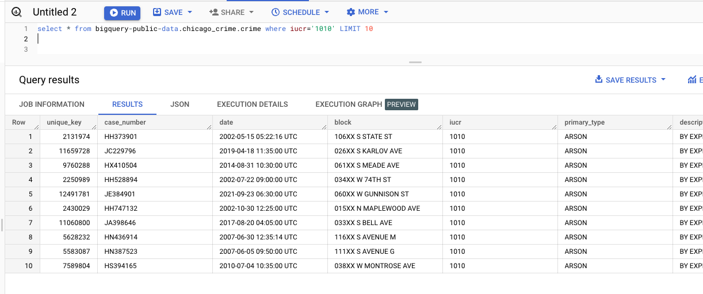
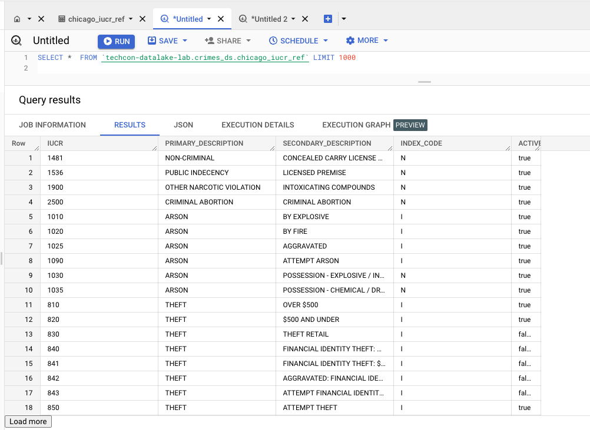

# Solutions for Challenge Lab

### 1. Explore the public dataset - bigquery-public-data.chicago_crime.crime
Paste in BigQuery UI-
```
SELECT
  *
FROM
  bigquery-public-data.chicago_crime.crime
WHERE
  iucr='1010'
LIMIT
  10
```
   
<br><br>

### 2. Study the table we just loaded - crimes_ds.chicago_iucr_ref. <br>
Paste in BigQuery UI-
```
SELECT
  *
FROM
  `crimes_ds.chicago_iucr_ref`
LIMIT
  10
```
   
<br><br>

Check for nulls; There should not be any-
```
SELECT
  *
FROM
  `crimes_ds.chicago_iucr_ref`
WHERE
  IUCR IS NULL
  OR IUCR=''
```

Check for distinct values, there should be no duplicates-
```
SELECT
  'IUCR_COUNT_DISTINCT' AS COUNT_TYPE,
  COUNT(DISTINCT IUCR) AS COUNT
FROM
  `crimes_ds.chicago_iucr_ref`
UNION ALL
SELECT
  'IUCR_COUNT' AS COUNT_TYPE,
  COUNT( IUCR) AS COUNT
FROM
  `crimes_ds.chicago_iucr_ref`
```

### 3. Analyze the relationship between the two tables and how they can be joined

From a quick visual, the column that the transactional crimes data and the reference IUCR codes data can be joined on is the IUCR codes. Lets study the IUCR codes across tables for code 0470-

<br>Lets look at the crimes transactional data-
```
SELECT
  *
FROM
  bigquery-public-data.chicago_crime.crime
WHERE
  iucr='2826'
LIMIT
  2
```

And then, the reference data-
```
SELECT
  *
FROM
  crimes_ds.chicago_iucr_ref
WHERE
  active
  AND iucr='2826'
```

Here is how the data across the tables can be matched.

| Matches | 
| -- |
| ```bigquery-public-data.chicago_crime.crime.iucr=crimes_ds.chicago_iucr_ref.iucr``` AND | 
| ```bigquery-public-data.chicago_crime.crime.primary_type=crimes_ds.chicago_iucr_ref.PRIMARY_DESCRIPTION``` for the matching IUCR code | 
| ```bigquery-public-data.chicago_crime.crime.description=crimes_ds.chicago_iucr_ref.SECONDARY_DESCRIPTION``` for the matching IUCR code | 


### 4. Identify if there are IUCR code/description discrepancies/mismatches across tables

There are discrepancies and this query catches them-
```
SELECT
  DISTINCT ct.iucr AS iucr_ct,
  rd.iucr AS iucr_rd,
  ct.primary_type AS primary_description,
  ct.description AS secondary_description
FROM
  bigquery-public-data.chicago_crime.crime ct
LEFT OUTER JOIN
  crimes_ds.chicago_iucr_ref rd
ON
  (ct.iucr=rd.iucr)
WHERE
  rd.iucr IS null
```

There are codes in the crimes (transactions) table that are not in the IUCR codes (reference data) table. <br>
Lets do a comparison based on IUCR descriptions.<br>

```
WITH
  IUCR_DISCREPANCIES AS(
  SELECT
    DISTINCT ct.iucr AS iucr_ct,
    rd.iucr AS iucr_rd,
    ct.primary_type AS primary_description,
    ct.description AS secondary_description
  FROM
    bigquery-public-data.chicago_crime.crime ct
  LEFT OUTER JOIN
    crimes_ds.chicago_iucr_ref rd
  ON
    (ct.iucr=rd.iucr)
  WHERE
    rd.iucr IS NULL)
SELECT
  IUCR_DISCREPANCIES.iucr_ct AS iucr_crimes,
  IUCR_DISCREPANCIES.primary_description,
  IUCR_DISCREPANCIES.secondary_description,
  IUCR_REF.iucr AS iucr_ref_data
FROM
  IUCR_DISCREPANCIES
JOIN
  crimes_ds.chicago_iucr_ref IUCR_REF
ON
  (IUCR_DISCREPANCIES.primary_description=IUCR_REF.primary_description
    AND IUCR_DISCREPANCIES.secondary_description=IUCR_REF.secondary_description)
```

Great! Looks like the data we have in the crimes table is good to go, and accurate. The reference data on the other hand had a few codes missing left padding with zeroes. As a data engineer, you would update the architect with your findings.

Lets proceed to the next step.

### 5. Identify missing entries in crimes table

We need to ensure that there are no missing entries in the crimes table, which we already established. Lets ensure there are no null/blank descriptions by running in the BigQuery UI-
```
SELECT
  *
FROM
  bigquery-public-data.chicago_crime.crime
WHERE
  primary_type IS NULL
  OR description IS null
 ```


Our crimes data is good from an IUCR persective. The data engineer would information the architect and proceed with development. Lets proceed to report building.


### 6. Create a crime trend report set with crimes by type, by year

Run in the BigQuery UI-
```
SELECT
  year,
  primary_type,
  description,
  COUNT(*) AS crime_count
FROM
  bigquery-public-data.chicago_crime.crime
GROUP BY
  year,
  primary_type,
  description
ORDER BY
  year,
  primary_type,
  description
  ```

<hr>

