# Data Lake Challenge Lab for TechCon 2023

## About the lab

This lab demonstrates integration of structured data in Cloud Storage into BigQuery with a minimum viable example of a CSV file containing Chicago crimes reference data into BigQuery from where we will run a crime trend report. The technology and product used to integrate are Apache Spark on Dataproc Serverless Batch. We will use a readily available Dataproc (integration) template (quickstart/solution accelerator) for the integration that does not require code authoring, just integration configuration. 

This lab is intended to be a gentle introduction to Dataproc for the BigQuery savvy user base that aspire to ease into open data analytics on Google Cloud Platform.

<br>
Lab duration: 30 minutes or less

<hr>

## Lab Solution Architecture

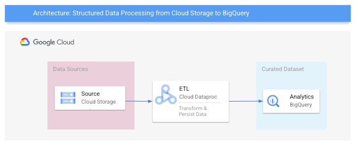   
<br><br>

<hr>

## About Dataproc Serverless Spark 

Dataproc Serverless Spark is a fully managed, autoscalable, zero ops, secure Spark as a service for data engineering and machine learning at scale. It offers a zero resource contention, democratized spark experience - accelerating developer productivity and speed to production. Learn more at - https://cloud.google.com/dataproc-serverless/docs 

<hr>


## About Dataproc Templates

Dataproc templates is an Apache Spark based, code-free solution to execute simple, but large, cloud data tasks, including data import/export/backup/restore and bulk API operations. Dataproc templates offers scale through parallelism natively available with Apache Spark, simplicity of management/zero ops through Dataproc's Serverless Spark feature (with autoscaling by default) and speed to production with its simplicity - no code, just configuration.

There are a variety of generally available templates that integrate disparate systems. Learn more at: https://github.com/GoogleCloudPlatform/dataproc-templates

<hr>


## Lab Module 1: Data Integration with Cloud Dataproc

### 1.1. Walk through of the environment provisioned

The automated provisioning creates the following. Optionally walk through the below on the Cloud Console.

| # | Entity/Service | Purpose | 
| -- |:--- | :--- | 
| 01 | Cloud Storage Buckets | To host data for the lab & scratch bucket for Dataproc Serverless and the BigQuery Spark connector |
| 02 | BigQuery Dataset | Logical container for target table |
| 03 | Networking | VPC, Subnet with private google access and firewall rule for intra-VPC open communication for Dataproc Serverless |
| 04 | User Managed Service Account | For provisioning services and to run integration tasks |
| 05 | IAM permissions | For the User Managed Service Account and the User Principal running the lab |
| 06 | Google APIs | For using the services needed for the lab |

The automation also includes upload of data needed in the lab into Cloud Storage.<br>
[Terraform scripts](00-resources/terraform/main.tf) | [Provisioning details just FYI](PROVISIONING.md)

Navigate the Cloud Console to each of the services/entities listed above and study what was provisioned for you.

<hr>


### 1.2. Integration execution

Documentation just FYI: <br>
https://cloud.google.com/dataproc-serverless/docs/templates/storage-to-bigquery#storage_to_bigquery_sample-gcloud
<br>

#### 1.2.1. Run the integration process

Paste and run in Cloud Shell-
```
REGION="us-central1"
PROJECT_ID=`gcloud config list --format "value(core.project)" 2>/dev/null`
PROJECT_NBR=`gcloud projects describe $GCP_PROJECT | grep projectNumber | cut -d':' -f2 |  tr -d "'" | xargs`
SUBNET="lab-snet"
DATA_SOURCE_GCS_URI="gs://data-${PROJECT_NBR}/"
BQ_DATASET_NM="crimes_ds"
BQ_TABLE_NM="chicago_iucr_ref"
SCRATCH_BUCKET_NM="lab-spark-bucket-${PROJECT_NBR}"
UMSA_FQN="lab-sa@$PROJECT_ID.iam.gserviceaccount.com"


gcloud dataproc batches submit spark \
    --class=com.google.cloud.dataproc.templates.main.DataProcTemplate \
    --version="1.1" \
    --project="$PROJECT_ID" \
    --region="$REGION" \
    --jars="gs://dataproc-templates-binaries/latest/java/dataproc-templates.jar" \
    --subnet="$SUBNET" \
    --service-account="$UMSA_FQN" \
    --batch="techcon-datalake-lab-$RANDOM" \
    -- --template=GCSTOBIGQUERY \
    --templateProperty log.level="INFO" \
    --templateProperty project.id="$PROJECT_ID" \
    --templateProperty gcs.bigquery.input.location="$DATA_SOURCE_GCS_URI" \
    --templateProperty gcs.bigquery.input.format="csv" \
    --templateProperty gcs.bigquery.output.dataset="$BQ_DATASET_NM" \
    --templateProperty gcs.bigquery.output.table="$BQ_TABLE_NM" \
    --templateProperty gcs.bigquery.temp.bucket.name="$SCRATCH_BUCKET_NM" 
 
```

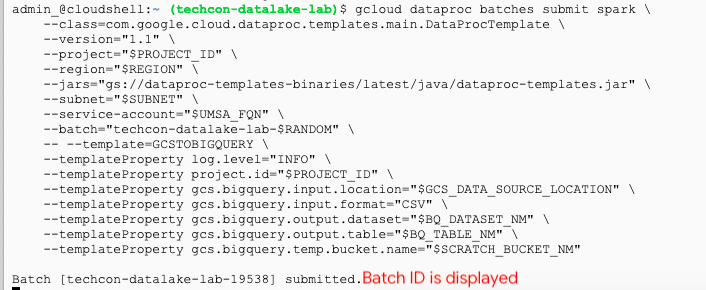   
<br><br>

### 1.2. Monitor the integration execution

1. Navigate to the Dataproc UI->Batches in the Cloud Console

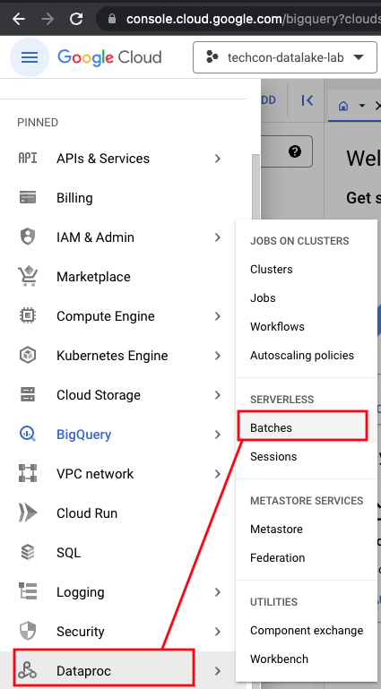   
<br><br>

2. Click on the batch job link displayed

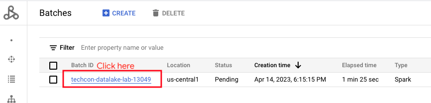   
<br><br>

3. Montiro to completion

   
<br><br>


### 1.3. Validation of integration operation

1. Navigate to the BigQuery UI on Cloud Console-

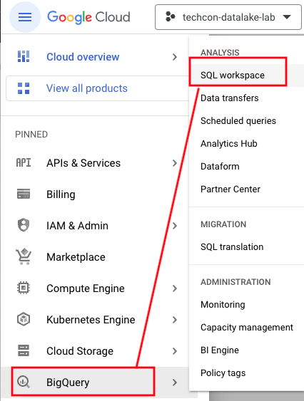   
<br><br>

2. Note the table created


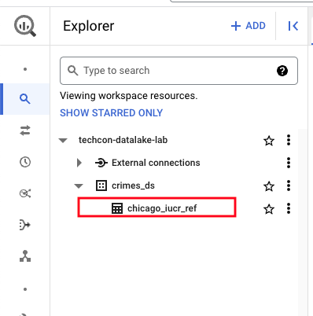   
<br><br>

3. Open the table


   
<br><br>

4. Review the schema

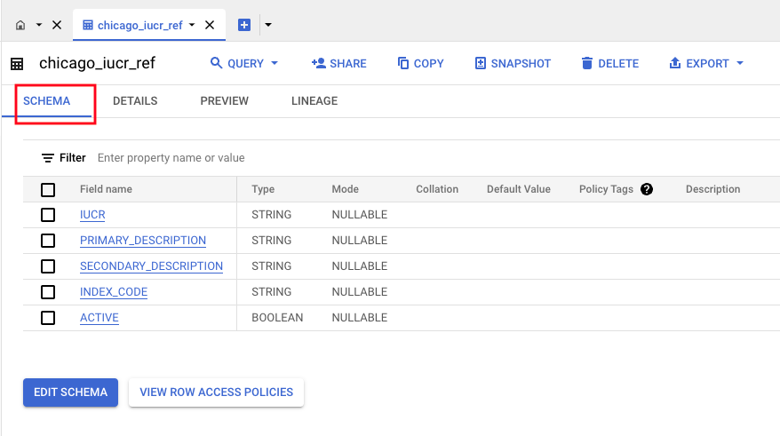   
<br><br>

5. Review the table details

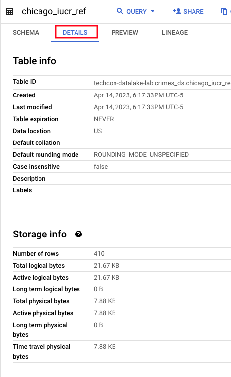   
<br><br>

6. Preview the data to validate the integration success

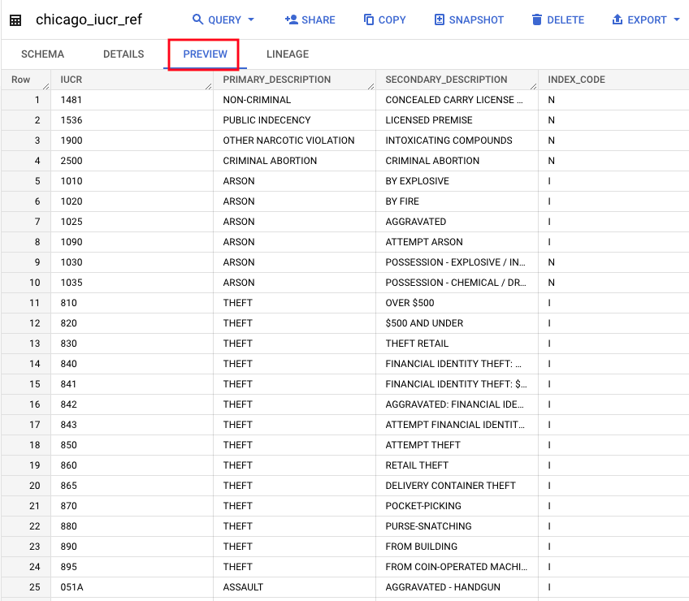   
<br><br>

<hr>

## CHALLENGE Lab Module 2: Data Analysis with BigQuery

BigQuery public dataset has Chicago crimes dataset. 

1. Explore the public dataset - bigquery-public-data.chicago_crime.crime
Paste in BigQuery UI-
```
select * from bigquery-public-data.chicago_crime.crime where iucr='1010' LIMIT 10
```
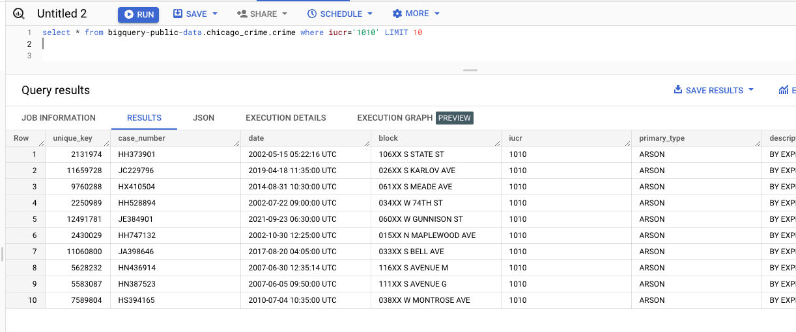   
<br><br>


2. Study the table we just loaded - crimes_ds.chicago_iucr_ref. <br>
Paste in BigQuery UI-
```
SELECT *  FROM `crimes_ds.chicago_iucr_ref` LIMIT 1000
```
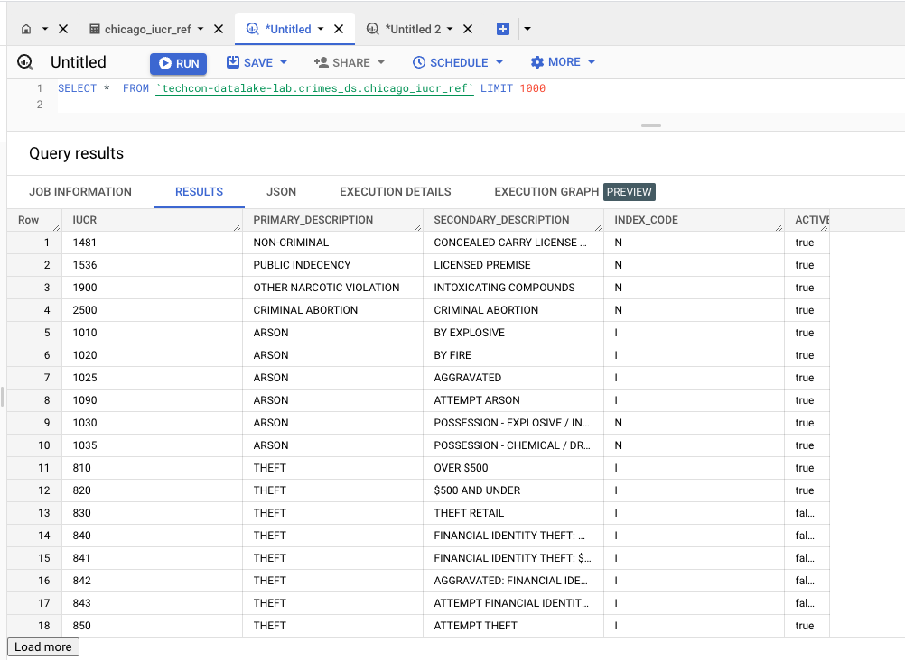   
<br><br>

Check for nulls; There should not be any-
```
SELECT * FROM `crimes_ds.chicago_iucr_ref` where IUCR is null or IUCR=''
```

Check for distinct values, there should be no duplicates-
```
SELECT 'IUCR_COUNT_DISTINCT' as COUNT_TYPE, count(distinct IUCR) as COUNT   FROM `crimes_ds.chicago_iucr_ref` 
UNION ALL
SELECT 'IUCR_COUNT' as COUNT_TYPE, count( IUCR) as COUNT   FROM `crimes_ds.chicago_iucr_ref` 
```

3. Analyze the relationship between the two tables and how they can be joined
4. Identify if there are IUCR description mismatches
5. Identify missing entries in either table
6. Create a crime trend report set with crimes by type, by year, month, week, day, hour.

<hr>


## Housekeeping

Thsi concludes the lab. Shut down your GCP project to avoid billing.

<hr>


